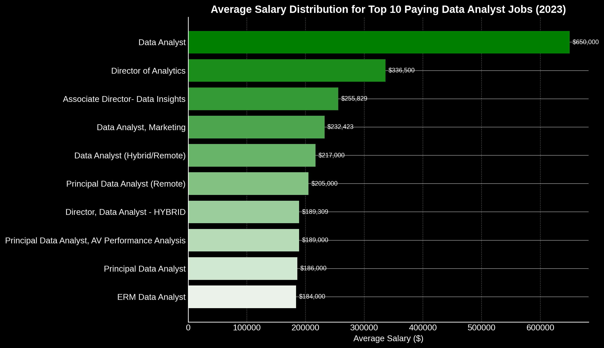
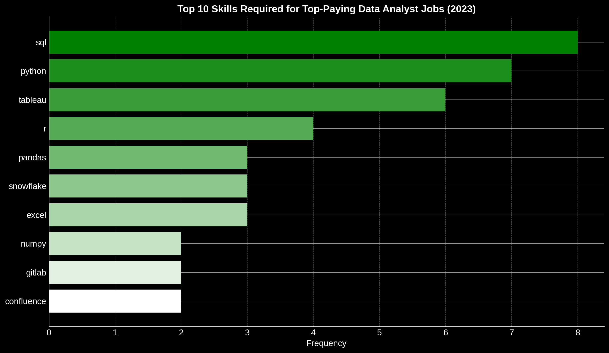

# Introduction
📊 Exploring the data analyst job market through SQL!
In this project, I answer 5 key questions to uncover 💰 the highest-paying roles, 🔧 the skills they require, 🔥 the most in-demand tools, and 🎯 which skills offer the best return on investment for aspiring analysts.

🔍 SQL queries? Check them out here: [project_sql folder](project_sql)

# Background
Driven by curiosity, portfolio building, and a desire to navigate the data analyst job market more effectively, this project was built to practice real-world SQL skills while uncovering valuable career insights. As part of the [SQL for Data Analytics by Luke Barousse](https://www.youtube.com/watch?v=7mz73uXD9DA), and wanted to apply what I learned in a meaningful way.

Using job posting data, I set out to answer five key questions:

1. What are the top-paying data analyst jobs?
2. What skills are required for these top-paying jobs?
3. What skills are most in demand for data analysts?
4. Which skills are associated with higher salaries?
5. What are the most optimal skills to learn?  

The result? A practical SQL project aimed at helping aspiring analysts (myself included) make smarter skill-building decisions.

# Tools I Used

For my deep dive into the data analyst job market, I harnessed the power of several key tools:

* **SQL**: The backbone of my analysis, allowing me to query the database and unearth critical insights.  
* **PostgreSQL**: The chosen database management system, ideal for handling the job posting data.  
* **Visual Studio Code**: My go-to for database management and executing SQL queries.  
* **Git & GitHub**: Essential for version control and sharing my SQL scripts and analysis, ensuring collaboration and project tracking.  

# The Anlaysis

Each query for this project aimed at investigating specific aspects of the data analyst job market. Here’s how I approached each question:

### 1. Top Paying Data Analyst Jobs
To identify the highest-paying roles, I filtered data analyst positions by average yearly salary and location, focusing on remote jobs. This query highlights the high paying opportunities in the field.

```sql
SELECT 
  job_id, 
  job_title,
  job_location, 
  job_schedule_type, 
  salary_year_avg, 
  job_posted_date::DATE,
  c.name AS company
FROM job_postings_fact AS jpf
LEFT JOIN company_dim AS c ON  jpf.company_id = c.company_id
WHERE 
  job_work_from_home = True AND
  job_location = 'Anywhere' AND 
  salary_year_avg IS NOT NULL AND 
  job_title_short = 'Data Analyst'
ORDER BY salary_year_avg DESC
LIMIT 10;
 ```
Here's the breakdown of the top data analyst jobs in 2023:

* Wide Salary Range: Top 10 paying data analyst roles span from $184,000 to $650,000, indicating significant salary potential in the field.
* Diverse Employers: Companies like SmartAsset, Meta, and AT&T are among those offering high salaries, showing a broad interest across different industries.
* Job Title Variety: There's a high diversity in job titles, from Data Analyst to Director of Analytics, reflecting varied roles and specializations within data analytics.




### 2. Skills for Top Paying Jobs
To understand what skills are required for the top-paying jobs, I joined the job postings with the skills data, providing insights into what employers value for high-compensation roles.

```sql
WITH top_ten_highest_paying AS (
    SELECT 
    job_id, 
    job_title,
    salary_year_avg, 
    c.name AS company
FROM job_postings_fact AS jpf
LEFT JOIN company_dim AS c ON  jpf.company_id = c.company_id
WHERE 
    job_work_from_home = True AND
    job_location = 'Anywhere' AND 
    salary_year_avg IS NOT NULL AND 
    job_title_short = 'Data Analyst'
ORDER BY salary_year_avg DESC
LIMIT 10
)

SELECT 
    top_ten_highest_paying.*,
    skills_dim.skills
FROM top_ten_highest_paying
INNER JOIN skills_job_dim ON top_ten_highest_paying.job_id = skills_job_dim.job_id
INNER JOIN skills_dim ON skills_job_dim.skill_id = skills_dim.skill_id
ORDER BY salary_year_avg DESC;
```
Here's the breakdown of the most demanded skills for the top 10 highest paying data analyst jobs in 2023:

* SQL is leading with a bold count of 8.
* Python follows closely with a bold count of 7.
* Tableau is also highly sought after, with a bold count of 6. Other skills like R, Snowflake, Pandas, and Excel show varying degrees of demand.



### 3. In-Demand Skills for Data Analysts
This query helped identify the skills most frequently requested in job postings, directing focus to areas with high demand.

```sql
SELECT  
    skills_dim.skills,
    COUNT(*) AS demand_count
FROM job_postings_fact
INNER JOIN skills_job_dim ON job_postings_fact.job_id = skills_job_dim.job_id
INNER JOIN skills_dim ON skills_job_dim.skill_id = skills_dim.skill_id
WHERE job_title_short = 'Data Analyst'
GROUP BY skills_dim.skills
ORDER BY demand_count DESC
LIMIT 5;
```
Here's the breakdown of the most demanded skills for data analysts in 2023

* SQL and Excel remain fundamental, emphasizing the need for strong foundational skills in data processing and spreadsheet manipulation.
* Programming and Visualization Tools like Python, Tableau, and Power BI are essential, pointing towards the increasing importance of technical skills in data storytelling and decision support.

| Rank | Skill     | Demand Count |
|------|-----------|--------------|
| 1    | SQL       | 92,628       |
| 2    | Excel     | 67,031       |
| 3    | Python    | 57,326       |
| 4    | Tableau   | 46,554       |
| 5    | Power BI  | 39,468       |

### 4. Skills Based on Salary
Exploring the average salaries associated with different skills revealed which skills are the highest paying.

```sql
SELECT  
    skills_dim.skills,
    ROUND(AVG(salary_year_avg), 0) AS salary_avg
FROM job_postings_fact
INNER JOIN skills_job_dim ON job_postings_fact.job_id = skills_job_dim.job_id
INNER JOIN skills_dim ON skills_job_dim.skill_id = skills_dim.skill_id
WHERE job_title_short = 'Data Analyst' AND job_work_from_home = True
GROUP BY skills_dim.skills
HAVING AVG(salary_year_avg) IS NOT NULL
ORDER BY salary_avg DESC
LIMIT 25;
```
Here's a breakdown of the results for top paying skills for Data Analysts:

* High Demand for Big Data & ML Skills: Top salaries are commanded by analysts skilled in big data technologies (PySpark, Couchbase), machine learning tools (DataRobot, Jupyter), and Python libraries (Pandas, NumPy), reflecting the industry's high valuation of data processing and predictive modeling capabilities.
* Software Development & Deployment Proficiency: Knowledge in development and deployment tools (GitLab, Kubernetes, Airflow) indicates a lucrative crossover between data analysis and engineering, with a premium on skills that facilitate automation and efficient data pipeline management.
* Cloud Computing Expertise: Familiarity with cloud and data engineering tools (Elasticsearch, Databricks, GCP) underscores the growing importance of cloud-based analytics environments, suggesting that cloud proficiency significantly boosts earning potential in data analytics.

| Rank | Skill        | Average Salary ($) |
|------|--------------|--------------------|
| 1    | PySpark      | 208,172            |
| 2    | Bitbucket    | 189,155            |
| 3    | Couchbase    | 160,515            |
| 4    | Watson       | 160,515            |
| 5    | DataRobot    | 155,486            |
| 6    | GitLab       | 154,500            |
| 7    | Swift        | 153,750            |
| 8    | Jupyter      | 152,777            |
| 9    | Pandas       | 151,821            |
| 10   | Elasticsearch| 145,000            |

### 5. Most Optimal Skills to Learn
Combining insights from demand and salary data, this query aimed to pinpoint skills that are both in high demand and have high salaries, offering a strategic focus for skill development.

```sql
SELECT 
    skills_dim.skill_id,
    skills_dim.skills, 
    COUNT(*) AS demand_count, 
    ROUND(AVG(salary_year_avg), 0) AS salary_avg
FROM job_postings_fact
INNER JOIN skills_job_dim ON job_postings_fact.job_id = skills_job_dim.job_id
INNER JOIN skills_dim ON skills_job_dim.skill_id = skills_dim.skill_id
WHERE 
    job_title_short = 'Data Analyst' 
    AND salary_year_avg IS NOT NULL
    AND job_work_from_home = True
GROUP BY skills_dim.skill_id
HAVING COUNT(*) > 10
ORDER BY 
    salary_avg DESC,
    demand_count DESC
LIMIT 25;
```

| Rank | Skill       | Demand Count | Average Salary ($) |
|------|-------------|---------------|---------------------|
| 1    | Go          | 27            | 115,320             |
| 2    | Confluence  | 11            | 114,210             |
| 3    | Hadoop      | 22            | 113,193             |
| 4    | Snowflake   | 37            | 112,948             |
| 5    | Azure       | 34            | 111,225             |
| 6    | BigQuery    | 13            | 109,654             |
| 7    | AWS         | 32            | 108,317             |
| 8    | Java        | 17            | 106,906             |
| 9    | SSIS        | 12            | 106,683             |
| 10   | Jira        | 20            | 104,918             |

Here's a breakdown of the most optimal skills for Data Analysts in 2023:

* High-Demand Programming Languages: Python and R stand out for their high demand, with demand counts of 236 and 148 respectively. * Despite their high demand, their average salaries are around $101,397 for Python and $100,499 for R, indicating that proficiency in these languages is highly valued but also widely available.
* Cloud Tools and Technologies: Skills in specialized technologies such as Snowflake, Azure, AWS, and BigQuery show significant demand with relatively high average salaries, pointing towards the growing importance of cloud platforms and big data technologies in data analysis.
* Business Intelligence and Visualization Tools: Tableau and Looker, with demand counts of 230 and 49 respectively, and average salaries around $99,288 and $103,795, highlight the critical role of data visualization and business intelligence in deriving actionable insights from data.
* Database Technologies: The demand for skills in traditional and NoSQL databases (Oracle, SQL Server, NoSQL) with average salaries ranging from $97,786 to $104,534, reflects the enduring need for data storage, retrieval, and management expertise.

# What I Learned

Throughout this project, I strengthened my SQL skills by diving into real job market data and answering complex analytical questions:

🧠 **Query Strategy**: Learned how to break down real-world questions into clear, focused SQL queries — not just writing code, but solving problems.

🔗 **JOINs**: using JOINs to combine data across tables and extract deeper insights.

🏗️ **CTEs & Subqueries**: Got hands-on with `WITH` clauses and nested subqueries to make my SQL cleaner, more readable, and more efficient.

📊 **Data Aggregation & Filtering**: Used `GROUP BY` and `HAVING` to categorize and analyze trends in salaries and skill demand.

🎯 **Real-World Application**: Applied everything to a real dataset, which made it click — this wasn’t just syntax practice, it was decision-making through data.

# Conclusions

### Insights
Digging into the data revealed several key takeaways about the data analyst job market:

* 💰 **Remote Roles:** The top-paying remote data analyst roles offer a wide salary range — with some reaching up to $650,000, highlighting the value of advanced analytical skill sets.

* 📈 **SQL Leads the Market in Demand:** Not only is SQL essential for high salaries — it’s also the most frequently requested skill overall, making it foundational for anyone entering the field.

* 🧪 **Niche Skills Command Higher Salaries:** Technologies like SVN and Solidity, while less common, are tied to significantly higher average salaries — suggesting that rare, specialized knowledge carries a premium.

## Closing Thoughts
This project was a great opportunity to sharpen my SQL skills while diving into the realities of the data analyst job market.
The analysis helped highlight which skills truly make a difference in salary and demand, offering a clearer path for anyone looking to grow in this field. For aspiring data analysts like myself, this project reinforced how important it is to stay adaptable, keep learning, and focus on the tools that open the most doors.
